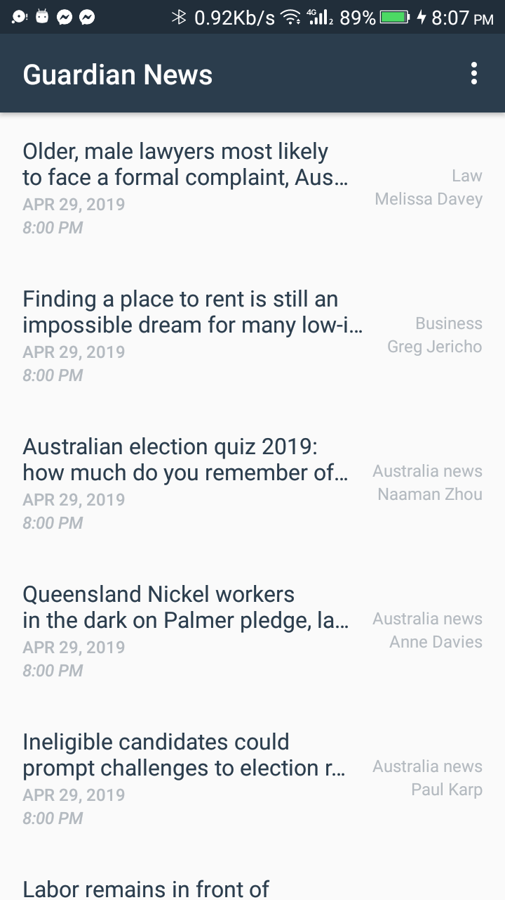
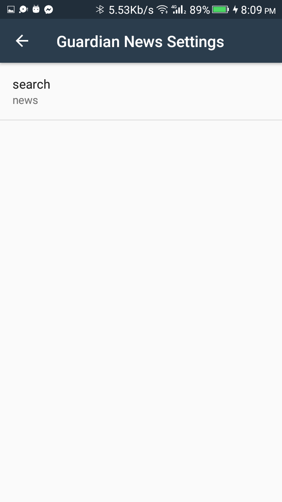

# Guardian-News
Guardian News app which gives a user regularly-updated news from the internet related to a particular topic.
Project which comes under Udacity Android Basics Nanodegree Program
# Description
This app will help you to read interesting news from The Guardian website using their API.
# Goodies
JSON Parsing.
ArrayAdapter.
ListView.
Loaders.
HttpURLConnection.
# Screenshots

